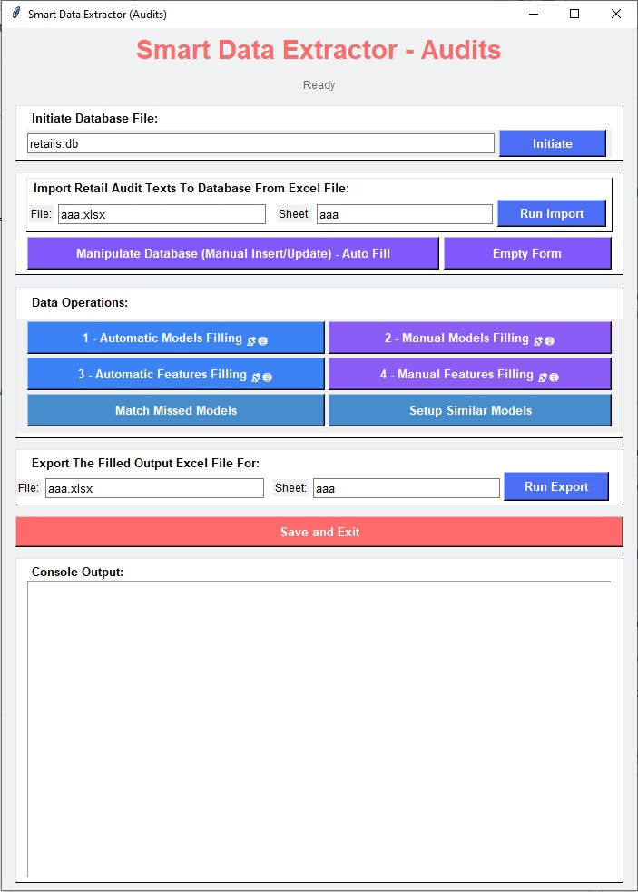

# Smart Data Extractor – Audits

**Smart Data Extractor – Audits** is a Windows-based desktop application designed to process, enrich, and clean retail audit data for 8 home appliance categories including: Air Conditioner, Dish Washer, Gas Oven, Microwave, Refrigerator, Television, Vacuum Cleaner, Washing Machine.  
The application takes raw Excel audit files, fills missing and incomplete fields using offline logic, online data extraction, and AI-powered completion, and outputs a fully completed Excel file ready for analysis.  
Examples of raw audit data: "X.VISION-F&F-SBS-TS552-AMD", "AKHAVAN-Cooking-GC-M13-EDTR", "لباسشویی DWK-SE991C", "فریزر 9 فوت ایستکول 5کشو مدل 2999 سفید"

## Table of Contents
- [Overview](#overview)
- [Key Capabilities](#key-capabilities)
- [System Requirements](#system-requirements)
- [Architecture Overview](#architecture-overview)
- [Installation](#installation)
- [Configuration](#configuration)
- [Running the Application](#running-the-application)
- [Input & Output](#input--output)
- [Application Workflow](#application-workflow)
- [Graphical User Interface](#graphical-user-interface)
- [Project Structure](#project-structure)
- [Technologies Used](#technologies-used)
- [Error Handling & Logging](#error-handling--logging)
- [Known Limitations](#known-limitations)
- [Troubleshooting](#troubleshooting)
- [FAQ](#faq)
- [Intended Audience](#intended-audience)
- [License](#license)
---  
---

## Overview
Retail audit datasets are often incomplete, inconsistent, or partially missing key information.  
This application addresses these issues by combining:
- Rule-based offline processing
- Online data extraction using Selenium 
- AI-assisted data completion via OpenAI
- Optional manual correction through a graphical interface
All operations are performed through a **Windows GUI**, making the tool accessible to both technical and non-technical users.
##### [<u>Table of Contents</u>](#table-of-contents)
## Key Capabilities
- Import raw audit data from Excel
- Store and manage data in a local SQLite database using offline rules
- Online data extraction using Selenium
- Automatic product model completion
- Manual remained product model completion
- Automatic product feature completion
- Manual remained product feature completion
- AI-based data completion (OpenAI)
- Smart menu for Manipulation database (insert/update)
- Matching and linking similar or missing models
- Export a clean, complete Excel file based on input Excel file
- All these functions under the Native Windows graphical interface (Tkinter)
##### [<u>Table of Contents</u>](#table-of-contents)
## System Requirements
- **Operating System:** Windows only
- **Python Version:** 3.12.3
- **Browser:** Google Chrome (required for Selenium)
- **Internet Connection:** Required for online extraction and AI completion
##### [<u>Table of Contents</u>](#table-of-contents)
## Architecture Overview
Smart Data Extractor – Audits follows a layered, modular architecture designed for reliability, extensibility, and human-in-the-loop data enrichment.  
The system combines local processing, online data extraction, and AI-assisted completion under a single desktop application.
### High-Level Architecture
```text
        ┌────────────────────────────┐
        │       User Interface       │
        │       (Tkinter GUI)        │
        └───────────┬────────────────┘
                    │
                    ▼
        ┌────────────────────────────┐
        │   Application Controller   │
        │         (main.py)          │
        └───────────┬────────────────┘
                    │
                    ▼
┌──────────────────────────────────────────────┐
│            Core Processing Layer             │
│                                              │
│  ┌───────────────┐   ┌────────────────────┐  │
│  │ Offline Logic │   │ Online Extraction  │  │
│  │ (Rules, NLP)  │   │ (Selenium, Chrome) │  │
│  └───────────────┘   └────────────────────┘  │
│                ┌─────────────────────────┐   │
│                │ AI Completion Layer     │   │
│                │ (OpenAI API)            │   │
│                └─────────────────────────┘   │
└───────────────────┬──────────────────────────┘
                    │
                    ▼
        ┌────────────────────────────┐
        │     Persistence Layer      │
        │     (SQLite Database)      │
        └───────────┬────────────────┘
                    │
                    ▼
        ┌────────────────────────────┐
        │        Export Layer        │
        │   (Excel Output Writer)    │
        └────────────────────────────┘
```
### Component Responsibilities
#### GUI Layer (Tkinter)
- Collects user inputs
- Triggers workflow steps via buttons
- Displays status, logs, and progress
- Runs long tasks in background threads
#### Application Controller
- Validates inputs
- Sequences operations
- Bridges GUI actions to backend logic
#### Core Processing Engine
- Imports Excel audit data
- Performs automatic and manual data completion
- Extracts models and features (online & AI-assisted)
- Manages processing states
#### Persistence Layer (SQLite)
- Stores raw, intermediate, and completed data
- Enables resume-safe and auditable processing
#### Export Layer
- Writes finalized, structured data back to Excel

### Workflow Model (State-Based)
```text
INIT
 ↓
Database Initiated
 ↓
Import Excel → Database
 ↓
Manual Insert / Cleanup (Optional)
 ↓
Automatic Model Extraction
 ↓
Manual Model Correction
 ↓
Automatic Feature Extraction
 ↓
Manual Feature Correction
 ↓
Model Unification & Matching
 ↓
Export to Excel
```
### Design Principles
- GUI-first, user-controlled workflow
- Human-in-the-Loop by Design
- Local-first (no server dependency), AI Second
- Local Data Sovereignty
- State-driven processing
- Explicit User Control
- Safe for sensitive market data
- Recoverable & Auditable Processing
##### [<u>Table of Contents</u>](#table-of-contents)
## Installation
### 1. Copy the Project
Copy the project root directory to your local Windows machine.
### 2. Create Virtual Environment
using command in the root directory of project:
```bash
python -m venv venv
```
activate the environment
```bash
venv\Scripts\activate
```
### 3. Install Dependencies
in the root directory of project:
```bash
pip install -r SmartDataExtractor/requirements.txt
```
##### [<u>Table of Contents</u>](#table-of-contents)
## Configuration
### OpenAI API Key
This application uses OpenAI for intelligent data completion.
1. Create a file named:
```bash
openai_api.txt
```
2. Place it in the **project root directory**
3. Paste only your API key inside the file:
```bash
sk-xxxxxxxxxxxxxxxxxxxxxxxx
```
No environment variables are required.
##### [<u>Table of Contents</u>](#table-of-contents)
## Running the Application
After activating the virtual environment, run:
```python
python main.py
```
##### [<u>Table of Contents</u>](#table-of-contents)
## Input & Output
### Input
- Excel file (.xlsx)
- Must be placed in the SmartDataExtractor directory
- File name and sheet name should be entered in the GUI
### Output
- Excel file (.xlsx)
- Same structure as input
- Missing fields are filled
- Data is cleaned and normalized
- Ready for analysis and reporting
##### [<u>Table of Contents</u>](#table-of-contents)
## Application Workflow
1. Launch the application
2. Initialize or select a SQLite database
3. Import the Excel audit file
4. Run automatic model completion
5. Run manual model filling
6. Run automatic feature completion
7. Run manual feature filling
6. Match missing models or setup unified models
7. Apply manual corrections if necessary by manipulating database
8. Export the completed Excel file
9. Save and exit
##### [<u>Table of Contents</u>](#table-of-contents)
## Graphical User Interface
The application provides a Windows desktop GUI built with Tkinter.
### Main Sections
- Database Initialization
- Excel Import Panel
- Data Operation Controls
- Manual Correction Tools
- Excel Export Panel
- Console Output for logs and messages  
  

##### [<u>Table of Contents</u>](#table-of-contents)
## Project Structure
```text
root_directory/
├── SmartDataExtractor/          # Main application package
│   ├── settings.json            # App configuration
│   ├── requirements.txt         # Python dependencies
│   ├── mapping-tables.xlsx      # Mapping reference data
│   ├── features definition.xlsx # Feature definitions
│   ├── database.py              # Database logic
│   └── prompts/                 # LLM prompt templates
├── venv/                        # Virtual environment
├── README.md                    # Project documentation
├── openai_api.txt               # OpenAI API key (local)
└── main.py                      # Application entry point <---
```
##### [<u>Table of Contents</u>](#table-of-contents)
## Technologies Used
- Python 3.12
- Tkinter
- Pandas
- SQLite
- Selenium
- OpenAI API
- openpyxl
##### [<u>Table of Contents</u>](#table-of-contents)
## Error Handling & Logging
- Runtime messages are displayed in the GUI console and status label
- Database CRUD operation and processing errors are surfaced to the user
- During development, exceptions can be raised for debugging
##### [<u>Table of Contents</u>](#table-of-contents)
## Known Limitations
- Windows-only application
- Requires Google Chrome
- Internet connection required for some features (marked with 📡🌐)
- The saturation of the circle icon next to the Audits 🔴 indicates the level of data completeness.
- AI-generated results may require manual review
- Not designed for concurrent multi-user access
- Not implemented for multi-thread data processing
- Wait until one process become complete, then start the next.
##### [<u>Table of Contents</u>](#table-of-contents)
## Troubleshooting
#### Application does not start
- Ensure Python 3.12.3 is installed
- Ensure the virtual environment is activated

#### Selenium errors
- Ensure Google Chrome is installed and updated
- Ensure internet connection is available

#### AI completion not working
- Verify openai_api.txt exists
- Verify API key validity
- Check internet connectivity
##### [<u>Table of Contents</u>](#table-of-contents)
## FAQ
### *How to know the format header of input file?*
- After initiating the database file,  
With empty file name and sheet name click on "Run Import"  
An empty file with samples, will be created in SmartDataExtractor\  
You can see the input format.  
Then "Run Import" with its file name and sheet name to add it to the database  
"Run Export" and watch the result output.xlsx  
Now Click on each function in the suggested order  
And after each function, "Run Export" , open the output.xlsx and see what happened.
#### *How to export all data in database?*
- After initiating the database file,  
with empty file name and sheet name click on "Run Export"
#### *What should we do for database filling if there is no internet connection?*
- if you gathered data manually and want to apply the changes to database,  
you could easily apply any change by Manipulate Database - Auto Fill  
or save them in the file and then Run Import,  
the new data will be replaced to insert or update database.
#### *Do I need programming knowledge to use this app?*
- No. The GUI is designed for non-technical users.
#### *Can I reuse the same Excel file?*
- Yes. The output file is a completed copy of the input.
#### *Is the data stored permanently?*
- Data is stored locally in a SQLite database until deleted.
##### [<u>Table of Contents</u>](#table-of-contents)
## Intended Audience
- Market analysis teams
- Internal company users
- Data and analytics departments
- Developers maintaining or extending the system
##### [<u>Table of Contents</u>](#table-of-contents)
## License

This project is intended for internal company use only.
##### [<u>Table of Contents</u>](#table-of-contents)
